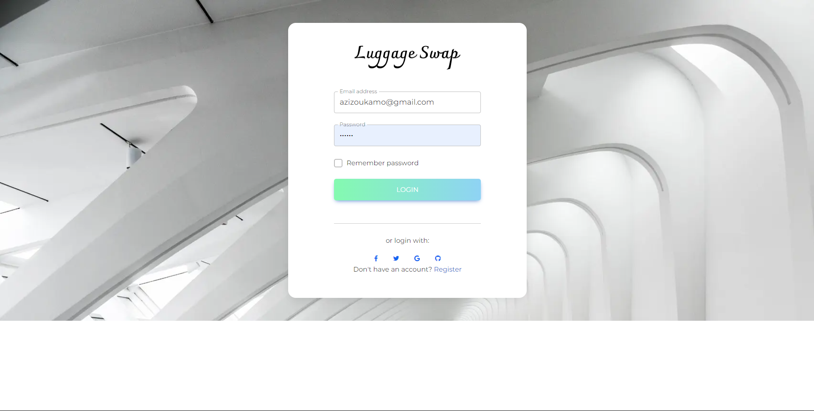
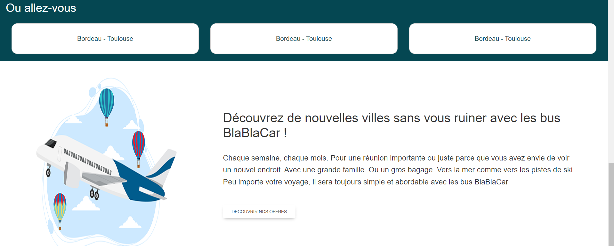

# Luggage Swap Website

Welcome to Luggage Swap! This project is built using React and TypeScript. The purpose of this website is to provide a platform where users can ship their luggage via travelers who are heading in the same direction.

## Table of Contents

- [Introduction](#introduction)
- [Features](#features)
- [Technologies Used](#technologies-used)
- [Installation](#installation)
- [Usage](#usage)
- [Contact](#contact)
- [Screenshots](#screenshots)

## Introduction

Luggage Swap is a web application designed to facilitate the shipping of luggage between users. By using this platform, you can protect the environment by reducing the unnecessary transactions typically involved in the shipping process through traditional agencies. Instead, the platform allows you to find a traveler who can take your luggage with them, making the process more efficient and eco-friendly.

## Features

- **User Authentication**: Secure login and registration system.
- **Item Listing**: Users can list their trips with the available weight they can take so that other users can make the reservation.
- **Search and Filter**: Advanced search functionality to find specific trips.
- **Messaging System**: Communicate directly with other users to negotiate swaps.
- **User Profiles**: View and manage your profile, including listed and swapped items.

## Technologies Used

- **React**: Frontend library for building user interfaces.
- **React Router**: For handling routing within the application.
- **Redux**: State management library for managing application state.
- **Firebase**: Backend-as-a-Service (BaaS) for user authentication and database.
- **CSS Modules**: For styling components in a modular and reusable way.
- **Axios**: For making HTTP requests.

## Installation

To get a local copy up and running, follow these simple steps:

1. **Clone the repository**:
   ```sh
   git clone https://github.com/aazizmegna/luggageswag-frontend.git
   ```
2. **Intall dependencies**:
   ```sh
   npm install
   ```

## Usage

1. **Start the development server**:

```sh
npm start
```

2. **Open http://localhost:3000 to view it in your browser**.

## Contact

azizoukamo@gmail.com

## Screenshots






